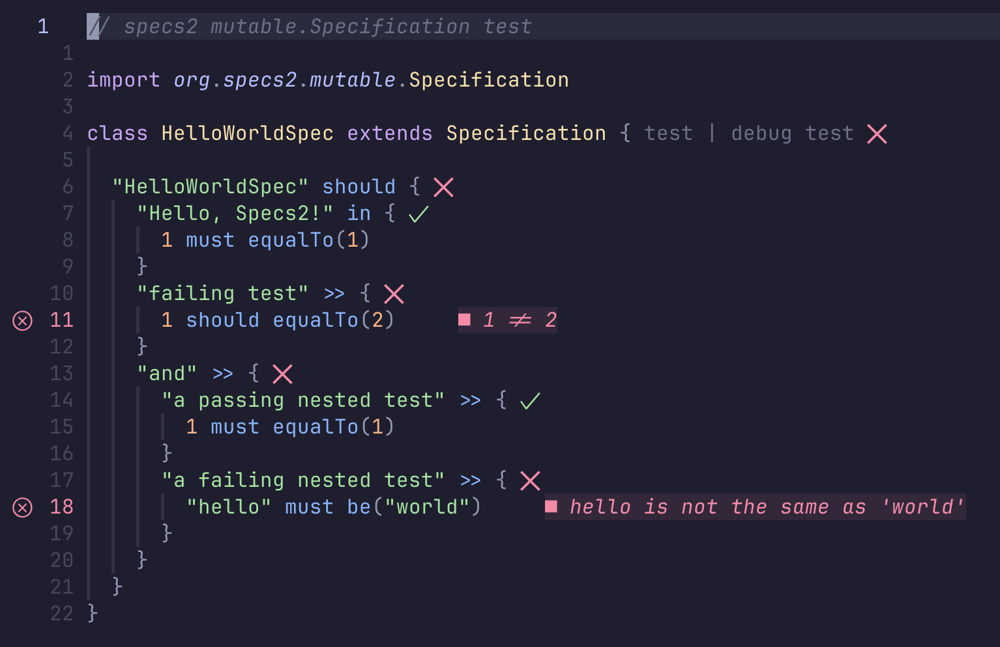

# neotest-scala



## !!! DISCLAIMER

This is a fork of original [neotest-scala](https://github.com/stevanmilic/neotest-scala), huge thanks to [Stevan Milic](https://github.com/stevanmilic) for making and maintaining this plugin.

Please use it at your own risk, any improvement proposals and contributions are welcome.

## About

[Neotest](https://github.com/rcarriga/neotest) adapter for Scala.

Supports the following Scala testing libraries:

- [utest](https://github.com/com-lihaoyi/utest)
- [munit](https://scalameta.org/munit/docs/getting-started.html)
- [scalatest](https://www.scalatest.org/)
- [specs2](https://etorreborre.github.io/specs2)
- [zio-test](https://zio.dev/reference/test/https://zio.dev/reference/test)

Runs tests with [sbt](https://www.scala-sbt.org) or [Bloop](https://scalacenter.github.io/bloop/) (faster!). \
Requires [nvim-metals](https://github.com/scalameta/nvim-metals) to get project metadata information

## Installation

Using [lazy.nvim](https://github.com/folke/lazy.nvim):

```lua
  {
    'nvim-neotest/neotest',
    dependencies = {
      'nvim-neotest/neotest-plenary',
      'olisikh/neotest-scala'
    },
  },
```

## Configuration

```lua
require("neotest").setup({
  adapters = {
    require("neotest-scala")
  }
})
```

### Build Tool Selection

By default, the plugin auto-detects whether to use Bloop or sbt. If a `.bloop/` directory exists, Bloop is used for faster test execution.

You can explicitly configure the build tool:

```lua
require("neotest").setup({
  adapters = {
    require("neotest-scala")({
      build_tool = "bloop",  -- "auto" (default), "bloop", or "sbt"
    })
  }
})
```

**Why Bloop?** Bloop is significantly faster than sbt because:
- It keeps a running compilation server (no JVM startup overhead)
- It caches compilations incrementally
- It's already running if you use Metals

### Background Compilation

Enable background compilation on file save for even faster test runs:

```lua
require("neotest").setup({
  adapters = {
    require("neotest-scala")({
      compile_on_save = true,  -- Compile in background when saving Scala files
    })
  }
})
```

### Additional Arguments

You may override some arguments that are passed into the build tool when you are running tests:

```lua
require("neotest").setup({
  adapters = {
    require("neotest-scala")({
      args = { "--no-colors" },
    })
  }
})
```

Also you have an option to dynamically specify `args` for SBT:

```lua
require("neotest").setup({
  adapters = {
    require("neotest-scala")({
      args = function(args)
        -- args table contains:
        --   path - full path to the file where test is executed
        --   framework - test library name that your test is implemented with
        --   project_name - project name the test is running on
        --   build_target_info - information about the build target collected from Metals

        return { "-v" }
      end,
    })
  }
})
```

## Debugging

Plugin also supports debugging tests with [nvim-dap](https://github.com/rcarriga/nvim-dap) (requires [nvim-metals](https://github.com/scalameta/nvim-metals)). \
You can debug individual test cases as well, but note that utest framework doesn't support this because it doesn't implement `sbt.testing.TestSelector`. \
To run tests with debugger pass `strategy = "dap"` when running neotest:

```lua
require('neotest').run.run({strategy = 'dap'})
```
